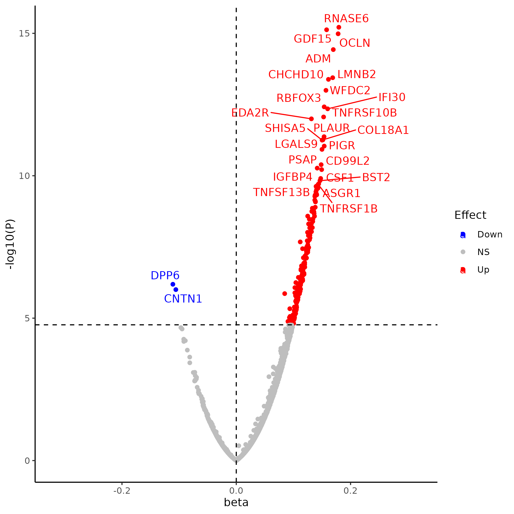
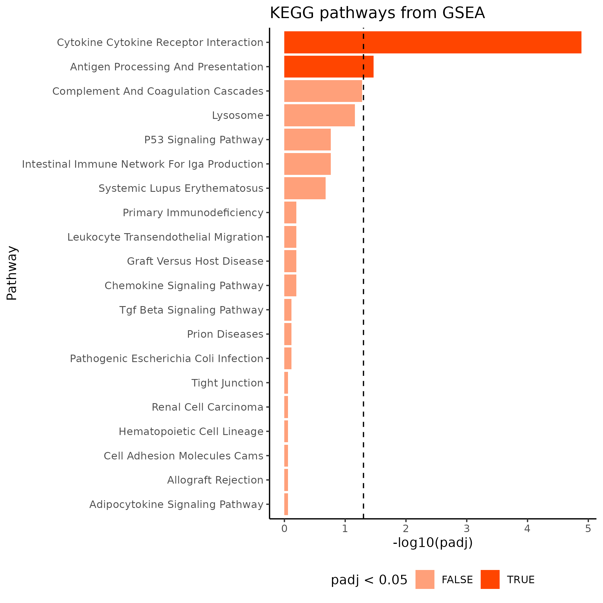
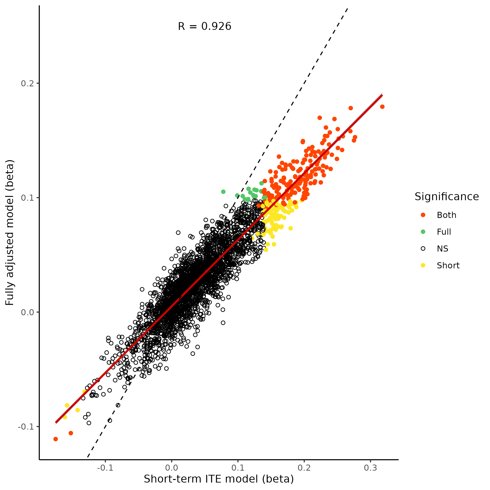

# Proteome-Wide Association Study for UKB proteomics database

This study aims to conduct a PWAS using clinical and proteomics dataset from the UK biobank to identify differentially expressed proteins and over-represented pathways among people with and without history of pneumonia.

# Study Design
1. Materials and Methods
The study utilize datasets containing baseline characteristics and proteomics data in UK Biobank. 

2. Statistical Analysis
A full model was generated with all covariates adjusted to explore the impact of previous pneumonia infection on proteomic profile. Two models (long and short pneumonia ITE model) were generated to investigate whether the main effect is driven by more recent pneumonia infection through sensitivity analysis.

    * Full Model: 
    INT(NPX) = β0 + β1 ∙ pneumonia infection + β2 ∙ age + β3 ∙ sex + β4 ∙ age2 + β5 ∙ (agesex) + β6 ∙ (age2sex) + β7 ∙ smoking status + β8 ∙ ethnicity + β9 ∙ batch	

    * Long pneumonia ITE Model:
    INT(NPX) = β0 + β1 ∙ long pneumonia ITE + β2 ∙ age + β3 ∙ sex + β4 ∙ age2 + β5 ∙ (agesex) + β6 ∙ (age2sex) + β7 ∙ smoking status + β8 ∙ ethnicity + β9 ∙ batch

    * Short pneumonia ITE Model:
    INT(NPX) = β0 + β1 ∙ short pneumonia ITE + β2 ∙ age + β3 ∙ sex + β4 ∙ age2 + β5 ∙ (agesex) + β6 ∙ (age2sex) + β7 ∙ smoking status + β8 ∙ ethnicity + β9 ∙ batch


# Table of Contents

- [Installation](#installation)
- [Usage](#usage)
- [Features](#features)
- [Configuration](#configuration)
- [Contact](#contact)

## Installation

```bash
# Example installation steps
git clone https://github.com/clu89/PWAS_UKB.git
setwd("PWAS_UKB")
install.packages("renv")
renv::restore() # Restores the R package environment from renv.lock
```

## Usage

```bash
## Install R first
Module load R
Rscript PWAS_UKB.R
```

## Features

- ***Data cleaning and management***

Data cleaning was conducted with tidyverse.

- *Calculate incidence time to enrollment*

Incidence time to enrollment is calculated by subtracting enrol_date from pneumonia_onset with difftime function as followed:

analysis$pneumonia_ite <- difftime(as.Date(analysis$pneumonia_onset), as.Date(analysis$enrol_date), unit = "days")

- ***Linear model construction***
1. Input data should contain exposure variable, covariates, and all columns for proteomics data.
2. Proteomics data matrix should only contain all columns for proteomics data.
3. Mode specifies the exposure variable and plot layout.
4. The exported table (PWAS result) should contain protein, beta coefficient, standard error, raw p-value, and Bonferroni-adjusted p-value.

```r
lm_pro(data = data, protein = proteomics_data_matrix, mode = "full", fill = "file_name")
```
**Output**

| Protein |    beta   |    SE    |    pval    |    Bonf    |
|---------|-----------|----------|------------|------------|
|RNASE6   |  0.1795	 |  0.0222  |  6.12E-16  |  1.79E-12  |
|GDF15	 |  0.1581	 |  0.0196  |  7.49E-16  |  2.19E-12  |
|OCLN	    |  0.1782	 |  0.0222  |  1.04E-15  |  3.03E-12  |
|ADM      |  0.1698	 |  0.0216  |  3.72E-15	 |  1.09E-11  |
|LMNB2	 |  0.1687	 |  0.0223  |  3.61E-14	 |  1.05E-10  |
|CHCHD10  |  0.1613	 |  0.0213  |  4.13E-14	 |  1.21E-10  |
|WFDC2	 |  0.1569	 |  0.0211  |  1.00E-13	 |  2.93E-10  |
|RBFOX3	 |  0.1539	 |  0.0212  |  3.81E-13	 |  1.11E-09  |
|IFI30	 |  0.1599	 |  0.0221  |  4.47E-13	 |  1.30E-09  |
|TNFRSF10B|	 0.1528	 |  0.0214  |  8.64E-13	 |  2.52E-09  |
|EDA2R	 |  0.1315	 |  0.0184  |  1.00E-12	 |  2.93E-09  |
|PLAUR	 |  0.1536	 |  0.0222  |  4.25E-12	 |  1.24E-08  |
|COL18A1  |  0.1516	 |  0.0220  |  5.49E-12	 |  1.60E-08  |
|SHISA5	 |  0.1502	 |  0.0218  |  5.62E-12	 |  1.64E-08  |
|PIGR	    |  0.1539	 |  0.0226  |  9.10E-12	 |  2.66E-08  |
|LGALS9	 |  0.1500	 |  0.0221  |  1.19E-11	 |  3.47E-08  |
|PSAP	    |  0.1485	 |  0.0225  |  4.09E-11	 |  1.19E-07  |
|IGFBP4	 |  0.1416	 |  0.0216  |  5.40E-11	 |  1.58E-07  |
|CD99L2	 |  0.1494	 |  0.0228  |  6.09E-11	 |  1.78E-07  |
|CSF1	    |  0.1477	 |  0.0230  |  1.25E-10	 |  3.63E-07  |

- ***Volcano plot***
1. Volcano plot serves as a visualization tool to indicate p-value distribution of associated proteins against beta coefficients.
2. Input data is the PWAS result table.
3. The output of this function is a scatter plot with upregulated proteins highlighted in red while downregualted proteins highlighted in blue.
4. Protein name of the top associations are attached nearby.

```r
Volcano(data = PWAS_data, file = "file_name")
```

**Output: Volcano plot**

<p align = "center">
<br>
 
</p>


- ***GSEA analysis***
1. GSEA analysis interpret the biological functions of proteins from PWAS result.
2. Top associated proteins are ranked according to the product of the sign of beta coefficient and -log10 transformed raw p-value.
3. msig_collection and subcollection specifies the collection of pathways that will be used for the analysisin humans.
4. database specifies which database will be used (ex. KEGG, GO, etc.).
5. range defines the number of pathways that will be plotted in the inverted bar chart.
6. All pathways were ranked by FDR-adjusted p-values.

```r
GSEA(data = PWAS_data, msig_collection = , subcollection, database, range)
```

**Output: GSEA plot**

<p align = "center">
<br>
 
</p>

- ***Correlation analysis***
1. Correlation plot compares the beta coefficient across different models (full vs short pneumonia ITE).
2. Correlation plot contains pearson correlation coefficient, reference line, regression line and all the proteins association plotted in scatter plot.

**Output: Correlation plot**

<p align = "center">
<br>

</p>


## Configuration

Using a newer version of R is recommended (ex. R/4.4.0). 


## Contact

For questions or support, contact [casper860311@gmail.com].


